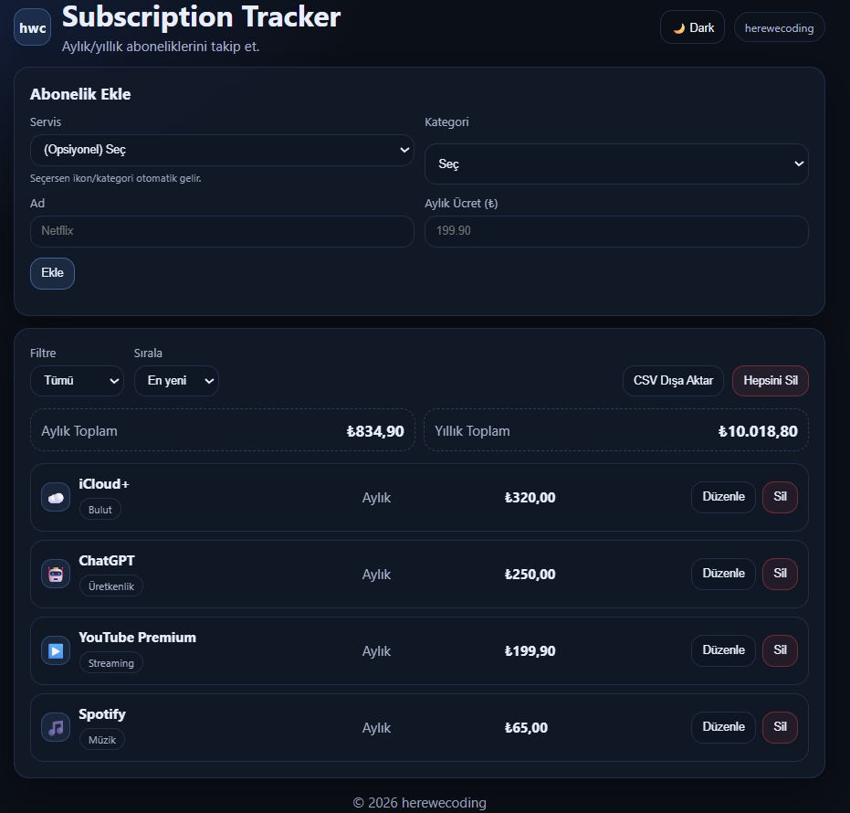

# Subscription Tracker (Vanilla JS)

A small web app to track subscriptions and calculate monthly & yearly costs. Data persists using LocalStorage.

## Live Demo
https://herewecoding.github.io/subscription-tracker/

## Features
- Add / edit / delete subscriptions
- Category filter
- Sorting (newest, price, name)
- Monthly & yearly totals
- LocalStorage persistence

## Tech Stack
- HTML, CSS, Vanilla JavaScript

## Run Locally
Open `index.html` in your browser.

## Screenshot

